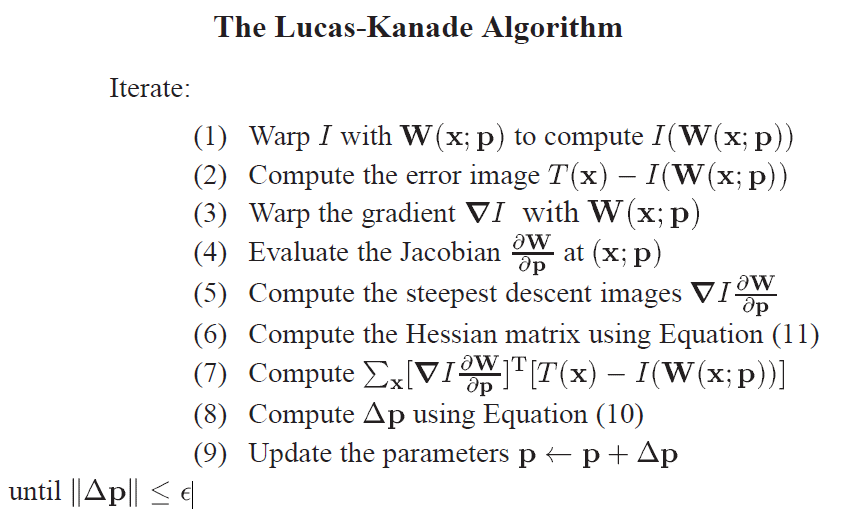

# Lucas-Kanade-Object-Tracker
Implementation of Lucas-Kanade template tracker for tracking objects.

## 1.Overview:

One incredibly important aspect of human and animal vision is the ability to follow objects and
people in our view. Whether it is a tiger chasing its prey, or you trying to catch a basketball,
tracking is so integral to our everyday lives that we forget how much we rely on it.

In this project I have implemented a Lucas-Kanade (LK) template tracker for tracking objects in the image sequence.
To initialize the tracker you need to define a template by drawing a
bounding box around the object to be tracked in the first frame of the
video. For each of the subsequent frames the tracker will update an affine
transform that warps the current frame so that the template in the first
frame is aligned with the warped current frame.

At the core of the algorithm is a function affineLKtracker(img, tmp, rect,
prev). This function will get as input a grayscale image of the current
frame (img), the template image (tmp), the bounding box (rect) that
marks the template region in tmp, and the parameters prev of the
previous warping. The function will iteratively compute the new warping
parameters pnew, and return these parameters.


The repository contains the python scripts for tracking various entities in the image sequence.

- ```car.py``` - For tracking car
- ```human.py``` - For tracking human
- ```vase.py``` - For tracking vase

Refer to the project report ```LK.pdf``` for further detials regarding the algorithm of Lucas-Kanade tracker. 


## 2. Output Video:

The output videos can be accesses here:

[Output Videos](https://drive.google.com/drive/folders/1HxfjfK__EUG9v9Yo_lXv5j2JV2Q1dNJ5?usp=sharing)


## 3. Lucas-Kanade Algorithm:


A schematic overview of the Lucas-Kanade algorithm is shown above. The image I is
warped with the current estimate of the warp in Step 1 and the result is subtracted from the template in Step 2 to yield the error image. The gradient of I is warped in Step 3, the Jacobian is computed in Step 4,
and the two combined in Step 5 to give the steepest descent images. In Step 6, the Hessian matrix is computed from the steepest descent images. In Step7, the steepest descent parameter updates are computed by calculating dot product between the error image and the steepest descent images. In Step 8, the Hessian is inverted and multiplied by the steepest descent parameter updates to
get the final parameter updates p which are then added to the
parameters p in Step 9.

### Algorithm steps:

The brief description of each steps in the Lucas Kanade algorithm is decribed below:




### Output:


